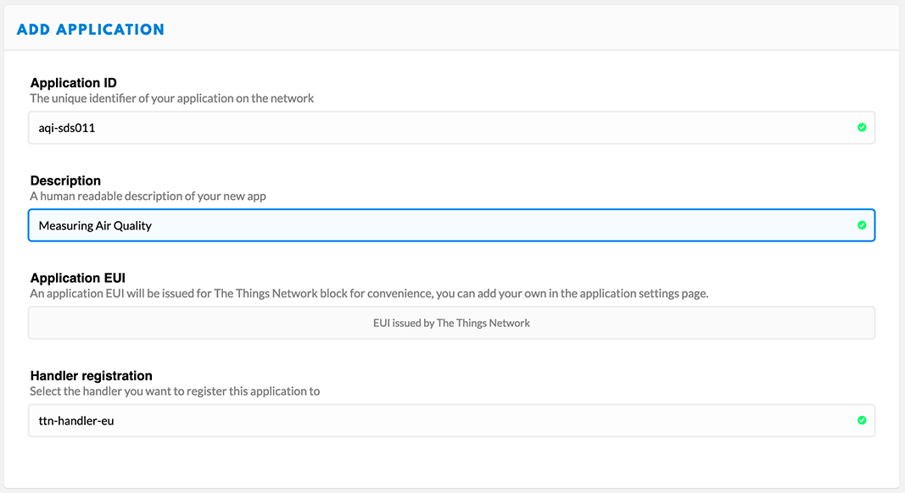
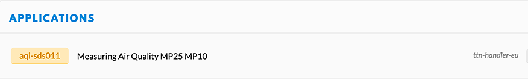
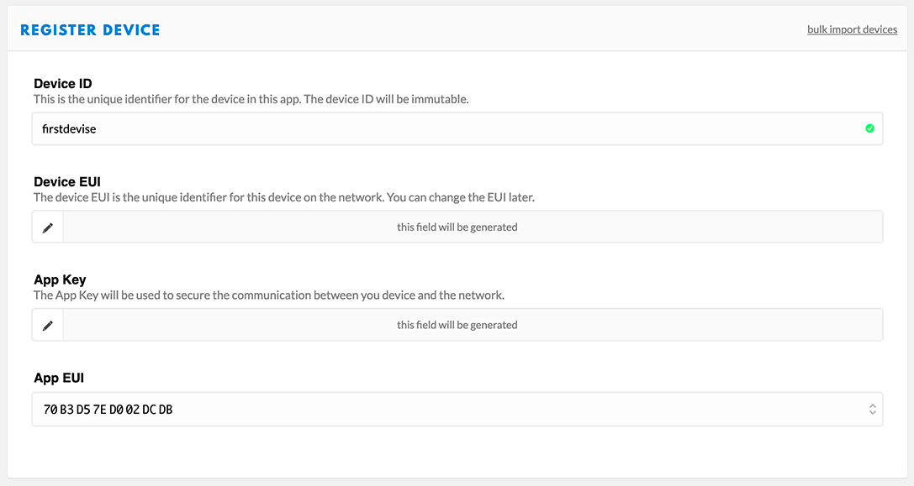
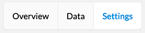

# EcoRadio
LoRaWAN HAT for Raspberry and EcoBoard with LCD,  I2C and UART connectors.

EcoRadio is a very usefull LoRaWAN HAT for EcoBoard and compatible with Raspberry boards.
The board has an U.FL connector for the Antenna and a I2C and UART connector to connect sensors.
You can easly connect a LCD OLED 128x64 to display messages

The board will be available current June 2020 and in the meantime, some C++ and Python script will be uploaded to let you easly start with the board

## LCD OLED
If you are using the 128x64 OLED LCD, you have to activate the I2C bus

```
sudo raspi-config
```
Then choose and activate it

* 5 Interface Options
* P5 i2C

### Installation of the libary
Update your Bustar OS, install pip3 and the needed packages

```
sudo apt update && sudo apt upgrade
sudo apt install python3-pip
sudo pip3 install adafruit-circuitpython-ssd1306
sudo apt install python3-pil
```

## RFM95 radio (LoRaWAN)
### Installation of the tiny-lora python library

```
sudo pip3 install adafruit-circuitpython-tinylora
```
### Preparation of your devise at TTN
We assume, you have created an account at [The Things Network (TTN)](https://www.thethingsnetwork.org)

Let's go to [your console](https://console.thethingsnetwork.org/) and create an application



Now, you will ne to create a devise. Return to your application view



click on the application you just created, select the "Devise" tab and then click **register device**




At the field **Device EUI**, make sure you can read *this field will be generated* or give an unique identifier.
or click on the two arrow, close to the field.

Fianly, click **register**.

Now, edit your new devise and got to the **settings** tab



and modify the followings settings


... update is coming
